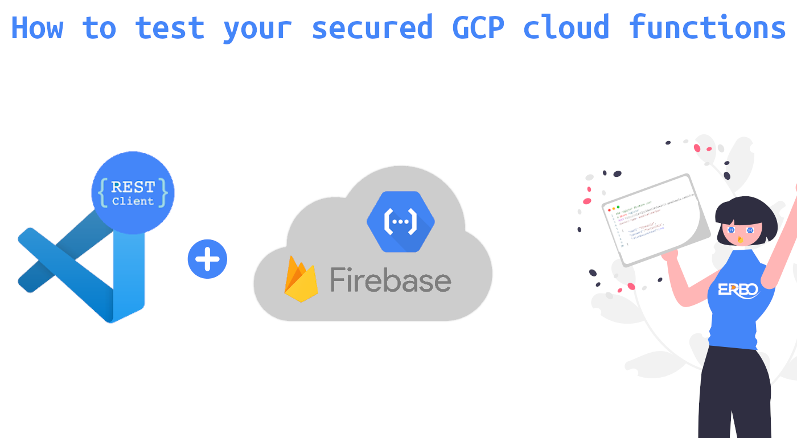

# How to test your secured GCP cloud functions
this branch is made for [this](https://medium.com/@erbo-engineering/c0ffc7aa499b) article on medium.
# Quick start

 - Read our article 😄
 - Make sure you have installed docker, docker-compose and nodejs.
 - Pull this branch and cd into it.
 - `cd` into the functions directory and run `npm install && npm run build`
 - Go back to main directory `cd ..` and run `docker-compose up -d`
 - Open the [functiontest.http](functions/httpTest/functiontest.http)
 - Try sending some requests and authenticate yourself by registering/logging in and then calling the cloud function at the bottom